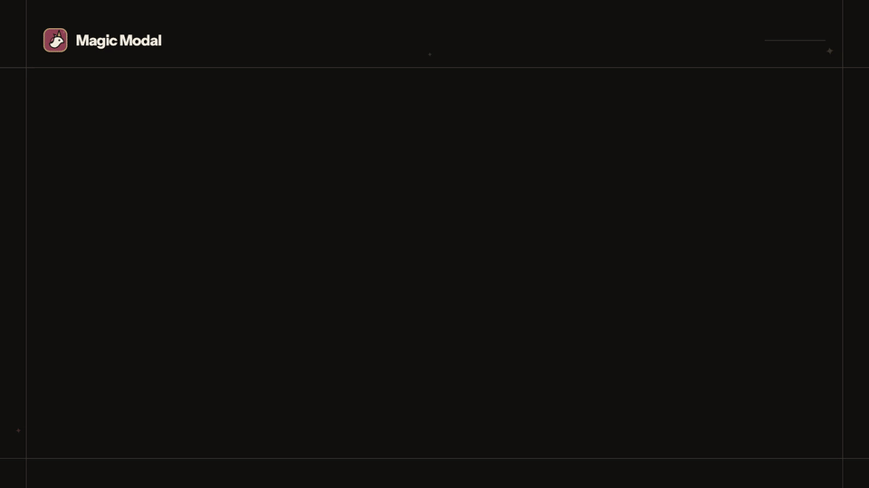

<h1 align="center">React Native Magic Modal</h1>

<p align="center">Open a modal from any async flow. Await a typed result when it closes.</p>



<p align="center">
  <a aria-label="NPM Version" href="https://www.npmjs.com/package/react-native-magic-modal">
    
  </a>
  <a aria-label="NPM Download Count" href="https://www.npmjs.com/package/react-native-magic-modal">
    
  </a>
  <a aria-label="License" href="https://www.npmjs.com/package/react-native-magic-modal">
    
  </a>
</p>
<p align="center">
  <a href="https://gstj.github.io/react-native-magic-modal/docs/">Docs</a> | <a href="https://github.com/gstj/react-native-magic-modal">GitHub</a> | <a href="https://gstj.github.io/react-native-magic-modal/docs/faq/">FAQ</a> | <a href="https://medium.com/@gabrieltaveira/you-have-been-using-react-native-modals-wrong-9b8c17de2f96">Article</a>
</p>

> [!NOTE]
> Magic Modal is a headless orchestration primitive: show modal content from anywhere, await a typed result, and keep styling in your own components.

> [!TIP]
> Guides and API reference live in the [documentation](https://gstj.github.io/react-native-magic-modal/docs/).

## Core API

- `magicModal.show()` renders content in the portal and returns an entry handle with a promise.
- `modalID` targets one entry for an update or close.
- `update()` replaces the component rendered by an open entry.
- `HideReturn<T>` records how the modal closed and carries submitted data.
- Modal components remain ordinary React Native UI.

## Table of Contents

- [Installation](#installation)
- [Quickstart](#quickstart)
- [Examples](#examples)
- [Documentation](#documentation)
- [FAQ](#faq)
- [Contributors](#contributors)

## Installation

Install the package and its native peers:

```bash
pnpm add react-native-magic-modal react-native-gesture-handler react-native-reanimated react-native-worklets react-native-screens
```

Minimum peer versions:

| Peer                           | Minimum |
| ------------------------------ | ------- |
| `react`                        | 18.0.0  |
| `react-native`                 | 0.81.0  |
| `react-native-gesture-handler` | 2.20.0  |
| `react-native-reanimated`      | 4.1.0   |
| `react-native-worklets`        | 0.5.0   |
| `react-native-screens`         | 4.19.0  |

Both gesture-handler majors work. Swipe-to-dismiss uses 3.x's `usePanGesture` hook when it's available and falls back to 2.x's `Gesture.Pan()` builder otherwise.

Reanimated 4 requires React Native's New Architecture. In a bare React Native app, add `"react-native-worklets/plugin"` last in `babel.config.js`, then run `npx pod-install`. Expo configures the plugin through its Babel preset; install compatible native versions with:

```bash
npx expo install react-native-gesture-handler react-native-reanimated react-native-worklets react-native-screens
pnpm add react-native-magic-modal
```

8.0.0 was the one version that required gesture-handler 3.x. If you're on it and pinned to 2.x, upgrade to 9.0.0 or later, and drop `react-native-gesture-handler` from `expo.install.exclude` if you added it to quiet the version check.

## Quickstart

Insert a `MagicModalPortal` at the top of your application structure, and a `GestureHandlerRootView` if you haven't already:

```tsx
import { MagicModalPortal } from "react-native-magic-modal";
import { GestureHandlerRootView } from "react-native-gesture-handler";

export default function App() {
  return (
    <GestureHandlerRootView style={{ flex: 1 }}>
      <YourAppContent />
      <MagicModalPortal /> {/** After your app component hierarchy */}
    </GestureHandlerRootView>
  );
}
```

Tip: the root `_layout.tsx` is usually the best place to put it in a project using expo-router.

The `GestureHandlerRootView` is required. The portal renders a `GestureDetector` for the swipe gesture, and gesture-handler 3.x throws when one renders without a root view above it. 2.x only logs a warning.

## Examples

Showcasing modal management on iOS and Android platforms:

| iOS                                                                                                                           | Android                                                                                                                       |
| ----------------------------------------------------------------------------------------------------------------------------- | ----------------------------------------------------------------------------------------------------------------------------- |
|  |  |

## Usage

Here's the preferred usage pattern for the library:

```tsx
import React from "react";
import { View, Text, TouchableOpacity } from "react-native";
import { magicModal, useMagicModal, MagicModalHideReason } from "react-native-magic-modal";

type ConfirmationModalReturn = {
  success: boolean;
};

const ConfirmationModal = () => {
  const { hide } = useMagicModal<ConfirmationModalReturn>();

  return (
    <View>
      <TouchableOpacity onPress={() => hide({ success: true })}>
        <Text>Click here to confirm</Text>
      </TouchableOpacity>
    </View>
  );
};

const ResponseModal = ({ text }) => {
  const { hide } = useMagicModal();

  return (
    <View>
      <Text>{text}</Text>
      <TouchableOpacity onPress={() => hide()}>
        <Text>Close</Text>
      </TouchableOpacity>
    </View>
  );
};

const handleConfirmationFlow = async () => {
  // You can call `show` with or without props, depending on the requirements of the modal.
  const result = await magicModal.show<ConfirmationModalReturn>(() => <ConfirmationModal />)
    .promise;

  // Hide could potentially be a backdrop press, a back button press, or a swipe gesture.
  if (result.reason !== MagicModalHideReason.INTENTIONAL_HIDE) {
    // User cancelled the flow
    return;
  }

  if (result.data.success) {
    return magicModal.show(() => <ResponseModal text="Success!" />).promise;
  }

  return magicModal.show(() => <ResponseModal text="Failure :(" />).promise;
};

export const MainScreen = () => {
  return (
    <TouchableOpacity onPress={handleConfirmationFlow}>
      <Text>Start the modal flow!</Text>
    </TouchableOpacity>
  );
};
```

You can also hide modals imperatively outside of the modal context. For that, we provide the global `hide` method, that requires a modal id:

```tsx
import { magicModal } from "react-native-magic-modal";

const QuickModal = ({ text }) => {
  return (
    <View>
      <Text>Hey! I'm going to be closed imperatively</Text>
    </View>
  );
};

const handleQuickModal = async () => {
  const { modalID } = magicModal.show(QuickModal);

  // Wait for 2 seconds before closing the modal
  await new Promise((resolve) => setTimeout(resolve, 2000));

  // Note that it's usually preferable to use the `hide` method from the modal context
  // You can even put it inside useEffects to handle auto-dismissal for you.
  magicModal.hide(undefined, { modalID });
};

export const MainScreen = () => {
  return (
    <TouchableOpacity onPress={handleQuickModal}>
      <Text>Show a quick modal</Text>
    </TouchableOpacity>
  );
};
```

`show` also hands you an `update` function, for when the data driving the modal lives outside of it:

```tsx
import { magicModal } from "react-native-magic-modal";

const UploadModal = ({ progress }) => (
  <View>
    <Text>Uploading, {progress}%</Text>
  </View>
);

const handleUpload = async (file) => {
  const { modalID, update } = magicModal.show(() => <UploadModal progress={0} />);

  await uploadFile(file, {
    onProgress: (progress) => update(() => <UploadModal progress={progress} />),
  });

  magicModal.hide(undefined, { modalID });
};
```

The modal itself stays put: same position in the stack, same backdrop, and the promise from `show` keeps waiting. Only the content is swapped, and it's a new component, so it mounts from scratch and anything it kept in `useState` is gone. If the state belongs to the modal, drive it from inside with a store or context instead.

Refer to the [kitchen-sink example](examples/kitchen-sink) for detailed usage scenarios.

## Documentation

Access the complete documentation [here](https://gstj.github.io/react-native-magic-modal/).

## FAQ

**Q:** Can I have two modals showing up at the same time?

**A:** Yes. With v4+, you can now have multiple modals showing up at the same time.

---

**Q:** Can I use Scrollables inside the modal?

**A:**
Yes, but Scrollables can't be used with swipe gestures enabled, as they conflict. Pass in `swipeDirection: undefined` on the `magicModal.show` function to disable gestures on them.

If your use-case is a scrollable bottom-sheet, I recommend going with Gorhom's react-native-bottom-sheet for this use-case temporarily.

---

**Q:** Modals are appearing on top of native modal screens, such as the image picker. How can I fix this?

**A:**
This behavior can be disabled by calling `magicModal.disableFullWindowOverlay()` before showing the modal. This will prevent the modal from appearing on top of native modal screens.

You can also call `magicModal.enableFullWindowOverlay()` to re-enable it.

## Contributors

Special thanks to everyone who contributed to making React Native Magic Modal a robust and user-friendly library. [See the full list](https://github.com/GSTJ/react-native-magic-modal/graphs/contributors).

See the [contributing guide](CONTRIBUTING.md) to learn how to contribute to the repository.

## License

React Native Magic Modal is licensed under the [MIT License](LICENSE).
